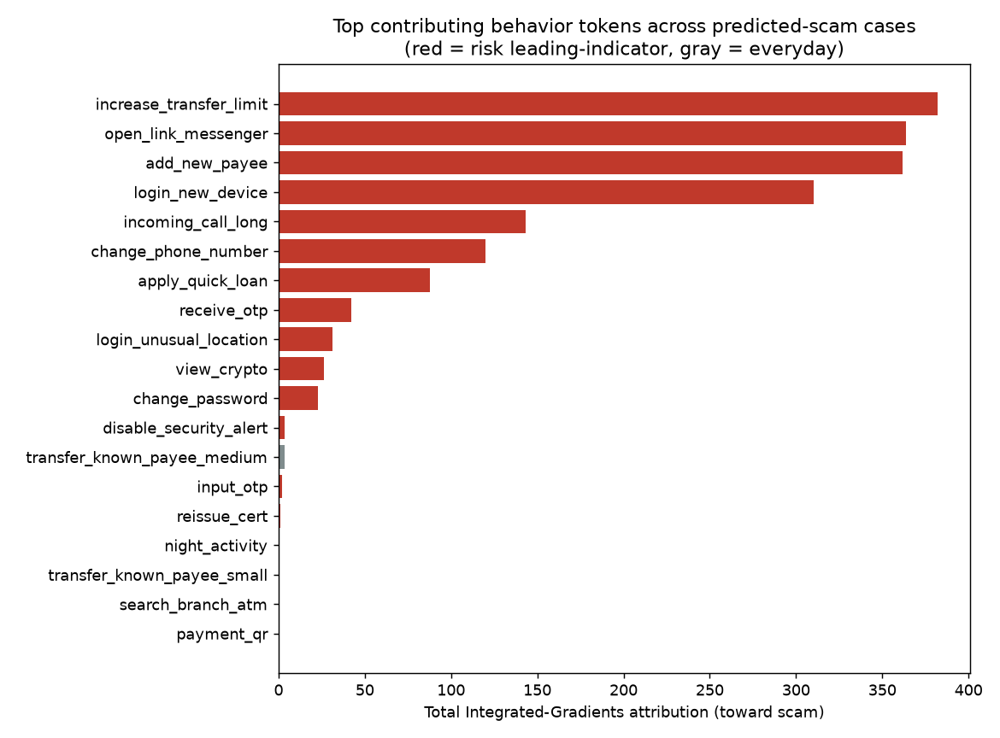

# Scam 예측 설명가능성 리포트 (Integrated Gradients)

모델이 **scam(Y=1)으로 예측한 검증셋 사례**들에 대해, 시퀀스 내 각 토큰(행동 이벤트)이 예측 점수를 scam 쪽으로 민 정도를 Integrated Gradients로 측정했다. 기준선(baseline)은 모든 행동 토큰을 `[PAD]`로 치환한 '행동 부재' 상태이며, 기여도 합은 completeness 성질에 의해 `f(input) − f(baseline)`(로짓 차이)와 같아야 한다.

## 요약

- 검증셋 표본수: 20,000
- 모델이 scam으로 예측(score ≥ 0.50): **208건**
- 설명 대상(상위 점수 208건) 중 실제 scam(TP) 200건 / 오탐(FP) 8건 (정밀도 0.962)
- IG 적분 스텝: 64, 평균 completeness 오차: 0.0005 (작을수록 근사 양호)

## 전체 집계: scam 예측을 가장 많이 견인한 행동

| 순위 | 토큰(행동) | 위험지표 | 상위5 등장수 | 누적 기여도 |
|---:|---|:---:|---:|---:|
| 1 | `increase_transfer_limit` | ✔ | 176 | 381.887 |
| 2 | `open_link_messenger` | ✔ | 134 | 363.490 |
| 3 | `add_new_payee` | ✔ | 232 | 361.960 |
| 4 | `login_new_device` | ✔ | 94 | 310.110 |
| 5 | `incoming_call_long` | ✔ | 92 | 143.395 |
| 6 | `change_phone_number` | ✔ | 64 | 119.763 |
| 7 | `apply_quick_loan` | ✔ | 58 | 87.641 |
| 8 | `receive_otp` | ✔ | 61 | 42.229 |
| 9 | `login_unusual_location` | ✔ | 34 | 31.394 |
| 10 | `view_crypto` | ✔ | 39 | 26.102 |
| 11 | `change_password` | ✔ | 29 | 22.713 |
| 12 | `disable_security_alert` | ✔ | 8 | 3.626 |
| 13 | `transfer_known_payee_medium` |  | 8 | 3.535 |
| 14 | `input_otp` | ✔ | 2 | 1.770 |
| 15 | `reissue_cert` | ✔ | 5 | 1.214 |
| 16 | `night_activity` | ✔ | 1 | 0.513 |
| 17 | `transfer_known_payee_small` |  | 1 | 0.419 |
| 18 | `search_branch_atm` |  | 1 | 0.137 |
| 19 | `payment_qr` |  | 1 | 0.065 |

## 정탐 사례 상세 (예측확률 상위 순)

### 사례 1: user #46463 — 예측확률 0.9998 [정탐(TP)]

- 로짓: input=8.337, baseline=-8.296, completeness 오차=0.0000
- 최근 행동 흐름(기여도): check_notification(▽-0.09) · check_notification(▽-0.05) · transfer_known_payee_small(▽-0.16) · apply_quick_loan(▲+0.13) · view_transactions(▽-0.51) · update_profile(▲+0.09) · open_link_sms(▲+0.54) · login_unusual_location(▲+0.25) · receive_otp(▲+2.46) · input_otp(▲+0.55) · add_new_payee(▲+1.19) · input_otp(▲+0.47) · receive_otp(▲+0.78) · open_app(▽-0.27) · input_otp(▲+0.28) · change_phone_number(▲+1.92) · add_new_payee(▲+2.35) · increase_transfer_limit(▲+8.55)

| 순위 | 토큰(행동) | 위치 | 직전간격 | 위험지표 | 기여도 | 비중 |
|---:|---|---:|:---:|:---:|---:|---:|
| 1 | `increase_transfer_limit` | 30 | 1-3h | ✔ | +8.554 | 43.1% |
| 2 | `receive_otp` | 21 | 1-3h | ✔ | +2.460 | 12.4% |
| 3 | `add_new_payee` | 29 | <1h | ✔ | +2.346 | 11.8% |
| 4 | `change_phone_number` | 28 | <1h | ✔ | +1.924 | 9.7% |
| 5 | `add_new_payee` | 23 | <1h | ✔ | +1.190 | 6.0% |
| 6 | `receive_otp` | 25 | 3-6h | ✔ | +0.776 | 3.9% |
| 7 | `input_otp` | 22 | <1h | ✔ | +0.547 | 2.8% |
| 8 | `open_link_sms` | 19 | <1h | ✔ | +0.540 | 2.7% |
| 9 | `input_otp` | 24 | 1-3h | ✔ | +0.466 | 2.3% |
| 10 | `input_otp` | 27 | <1h | ✔ | +0.283 | 1.4% |

### 사례 2: user #50818 — 예측확률 0.9998 [정탐(TP)]

- 로짓: input=8.333, baseline=-8.334, completeness 오차=0.0000
- 최근 행동 흐름(기여도): view_balance(▽-0.17) · open_chatbot(▽-0.08) · withdrawal_atm(▽-0.02) · view_balance(▽-0.06) · view_transactions(▽-0.35) · idle(▽-0.28) · transit_payment(▽-0.08) · transfer_known_payee_medium(▲+0.07) · login_success(▲+0.07) · transit_payment(▽-0.17) · check_notification(▽-0.14) · open_link_messenger(▲+4.29) · incoming_call_long(▲+0.79) · add_new_payee(▲+3.24) · incoming_call_long(▲+1.79) · incoming_call_long(▲+2.42) · transfer_known_payee_medium(▽-0.03) · login_new_device(▲+5.57)

| 순위 | 토큰(행동) | 위치 | 직전간격 | 위험지표 | 기여도 | 비중 |
|---:|---|---:|:---:|:---:|---:|---:|
| 1 | `login_new_device` | 25 | <1h | ✔ | +5.567 | 30.2% |
| 2 | `open_link_messenger` | 19 | 12-24h | ✔ | +4.287 | 23.2% |
| 3 | `add_new_payee` | 21 | 6-12h | ✔ | +3.245 | 17.6% |
| 4 | `incoming_call_long` | 23 | 3-6h | ✔ | +2.419 | 13.1% |
| 5 | `incoming_call_long` | 22 | <1h | ✔ | +1.794 | 9.7% |
| 6 | `incoming_call_long` | 20 | 1-3h | ✔ | +0.791 | 4.3% |
| 7 | `open_link_sms` | 7 | 1-2d | ✔ | +0.213 | 1.2% |
| 8 | `login_success` | 16 | 6-12h |  | +0.070 | 0.4% |
| 9 | `transfer_known_payee_medium` | 15 | 3-6h |  | +0.066 | 0.4% |
| 10 | `withdrawal_atm` | 10 | 1-3h |  | -0.022 | -0.1% |

### 사례 3: user #45864 — 예측확률 0.9998 [정탐(TP)]

- 로짓: input=8.331, baseline=4.670, completeness 오차=0.0018
- 최근 행동 흐름(기여도): view_balance(▽-0.04) · transfer_known_payee_small(▽-0.19) · open_link_messenger(▲+1.28) · incoming_call_long(▲+0.14) · open_link_sms(▲+0.26) · install_external_app(▲+0.07) · grant_accessibility_perm(▲+0.30) · login_new_device(▲+1.66) · reissue_cert(▲+0.10) · change_password(▲+0.44) · card_payment_small(▽-0.34) · update_profile(▲+0.05) · logout(▽-0.34) · disable_security_alert(▲+0.08) · disable_security_alert(▲+0.16) · increase_transfer_limit(▲+2.28) · add_new_payee(▲+1.02) · night_activity(▲+0.09)

| 순위 | 토큰(행동) | 위치 | 직전간격 | 위험지표 | 기여도 | 비중 |
|---:|---|---:|:---:|:---:|---:|---:|
| 1 | `increase_transfer_limit` | 42 | <1h | ✔ | +2.276 | 27.6% |
| 2 | `login_new_device` | 34 | 1-3h | ✔ | +1.656 | 20.1% |
| 3 | `open_link_messenger` | 29 | 12-24h | ✔ | +1.284 | 15.6% |
| 4 | `add_new_payee` | 43 | <1h | ✔ | +1.021 | 12.4% |
| 5 | `change_password` | 36 | 1-3h | ✔ | +0.436 | 5.3% |
| 6 | `grant_accessibility_perm` | 33 | <1h | ✔ | +0.297 | 3.6% |
| 7 | `open_link_sms` | 31 | 1-3h | ✔ | +0.262 | 3.2% |
| 8 | `login_new_device` | 20 | 3-6h | ✔ | +0.224 | 2.7% |
| 9 | `disable_security_alert` | 41 | 12-24h | ✔ | +0.158 | 1.9% |
| 10 | `incoming_call_long` | 30 | 12-24h | ✔ | +0.144 | 1.8% |

### 사례 4: user #43228 — 예측확률 0.9998 [정탐(TP)]

- 로짓: input=8.331, baseline=8.080, completeness 오차=0.0001
- 최근 행동 흐름(기여도): open_link_messenger(▲+0.04) · view_event_promo(▽-0.01) · view_crypto(▲+0.02) · apply_quick_loan(▲+0.02) · view_crypto(▲+0.03) · view_balance(▽-0.02) · view_card_benefit(▽-0.01) · biometric_auth(▽-0.01) · withdrawal_atm(▽-0.01) · view_crypto(▲+0.02) · increase_transfer_limit(▲+0.17) · transit_payment(▽-0.03) · reissue_cert(▲+0.01) · apply_quick_loan(▲+0.03) · add_new_payee(▲+0.06) · view_crypto(▲+0.02) · card_payment_medium(▽-0.02) · increase_transfer_limit(▲+0.12)

| 순위 | 토큰(행동) | 위치 | 직전간격 | 위험지표 | 기여도 | 비중 |
|---:|---|---:|:---:|:---:|---:|---:|
| 1 | `increase_transfer_limit` | 57 | 1-3h | ✔ | +0.166 | 29.7% |
| 2 | `increase_transfer_limit` | 64 | <1h | ✔ | +0.118 | 21.2% |
| 3 | `add_new_payee` | 61 | <1h | ✔ | +0.056 | 10.1% |
| 4 | `open_link_messenger` | 47 | 3-6h | ✔ | +0.039 | 7.0% |
| 5 | `apply_quick_loan` | 60 | 6-12h | ✔ | +0.034 | 6.2% |
| 6 | `view_crypto` | 51 | 1-3h | ✔ | +0.025 | 4.5% |
| 7 | `view_crypto` | 49 | 1-3h | ✔ | +0.022 | 3.9% |
| 8 | `view_crypto` | 56 | <1h | ✔ | +0.021 | 3.8% |
| 9 | `input_otp` | 38 | 3-6h | ✔ | +0.020 | 3.5% |
| 10 | `apply_quick_loan` | 50 | <1h | ✔ | +0.018 | 3.3% |

### 사례 5: user #46657 — 예측확률 0.9998 [정탐(TP)]

- 로짓: input=8.327, baseline=7.189, completeness 오차=0.0005
- 최근 행동 흐름(기여도): pay_subscription(▽-0.04) · withdrawal_atm(▲+0.02) · open_chatbot(▽-0.15) · view_transactions(▽-0.11) · open_link_sms(▲+0.10) · login_unusual_location(▲+0.09) · open_chatbot(▽-0.14) · receive_otp(▲+0.13) · input_otp(▲+0.09) · receive_otp(▲+0.21) · open_link_sms(▲+0.09) · input_otp(▽-0.07) · add_new_payee(▲+0.24) · reissue_cert(▲+0.17) · change_phone_number(▲+0.30) · login_unusual_location(▲+0.11) · add_new_payee(▲+0.27) · increase_transfer_limit(▲+1.32)

| 순위 | 토큰(행동) | 위치 | 직전간격 | 위험지표 | 기여도 | 비중 |
|---:|---|---:|:---:|:---:|---:|---:|
| 1 | `increase_transfer_limit` | 64 | <1h | ✔ | +1.319 | 37.9% |
| 2 | `change_phone_number` | 61 | <1h | ✔ | +0.302 | 8.7% |
| 3 | `add_new_payee` | 63 | <1h | ✔ | +0.268 | 7.7% |
| 4 | `incoming_call_long` | 34 | 1-3h | ✔ | +0.253 | 7.3% |
| 5 | `add_new_payee` | 59 | <1h | ✔ | +0.245 | 7.0% |
| 6 | `receive_otp` | 56 | <1h | ✔ | +0.209 | 6.0% |
| 7 | `reissue_cert` | 60 | <1h | ✔ | +0.166 | 4.8% |
| 8 | `receive_otp` | 54 | <1h | ✔ | +0.127 | 3.6% |
| 9 | `login_unusual_location` | 62 | <1h | ✔ | +0.110 | 3.2% |
| 10 | `open_link_sms` | 51 | 12-24h | ✔ | +0.095 | 2.7% |

### 사례 6: user #82468 — 예측확률 0.9998 [정탐(TP)]

- 로짓: input=8.327, baseline=-8.247, completeness 오차=0.0001
- 최근 행동 흐름(기여도): view_stock(▽-0.12) · check_notification(▽-0.20) · check_notification(▽-0.35) · login_new_device(▲+0.90) · view_point(▽-0.18) · check_notification(▽-0.13) · view_crypto(▲+1.62) · open_link_messenger(▲+4.91) · logout(▽-0.47) · view_crypto(▲+0.90) · view_crypto(▲+0.63) · view_crypto(▲+1.16) · increase_transfer_limit(▲+0.88) · pay_subscription(▽-0.40) · apply_quick_loan(▲+5.25) · idle(▽-0.25) · apply_quick_loan(▲+1.90) · add_new_payee(▲+3.64)

| 순위 | 토큰(행동) | 위치 | 직전간격 | 위험지표 | 기여도 | 비중 |
|---:|---|---:|:---:|:---:|---:|---:|
| 1 | `apply_quick_loan` | 29 | 6-12h | ✔ | +5.245 | 24.1% |
| 2 | `open_link_messenger` | 22 | 1-3h | ✔ | +4.914 | 22.6% |
| 3 | `add_new_payee` | 32 | 1-3h | ✔ | +3.645 | 16.7% |
| 4 | `apply_quick_loan` | 31 | 3-6h | ✔ | +1.896 | 8.7% |
| 5 | `view_crypto` | 21 | 3-6h | ✔ | +1.616 | 7.4% |
| 6 | `view_crypto` | 26 | 3-6h | ✔ | +1.157 | 5.3% |
| 7 | `view_crypto` | 24 | 3-6h | ✔ | +0.904 | 4.1% |
| 8 | `login_new_device` | 18 | 12-24h | ✔ | +0.897 | 4.1% |
| 9 | `increase_transfer_limit` | 27 | <1h | ✔ | +0.879 | 4.0% |
| 10 | `view_crypto` | 25 | 3-6h | ✔ | +0.634 | 2.9% |

### 사례 7: user #12006 — 예측확률 0.9998 [정탐(TP)]

- 로짓: input=8.325, baseline=-8.332, completeness 오차=0.0000
- 최근 행동 흐름(기여도): view_fund(▽-0.10) · transfer_known_payee_small(▽-0.07) · transit_payment(▽-0.15) · transfer_known_payee_small(▽-0.09) · view_point(▽-0.06) · biometric_auth(▽-0.15) · login_success(▽-0.07) · view_balance(▽-0.56) · open_link_messenger(▲+4.77) · transit_payment(▽-0.20) · view_crypto(▲+0.41) · view_crypto(▲+1.38) · idle(▽-0.21) · view_crypto(▲+0.70) · increase_transfer_limit(▲+4.10) · apply_quick_loan(▲+0.85) · increase_transfer_limit(▲+5.11) · add_new_payee(▲+1.98)

| 순위 | 토큰(행동) | 위치 | 직전간격 | 위험지표 | 기여도 | 비중 |
|---:|---|---:|:---:|:---:|---:|---:|
| 1 | `increase_transfer_limit` | 26 | <1h | ✔ | +5.113 | 26.5% |
| 2 | `open_link_messenger` | 18 | 12-24h | ✔ | +4.772 | 24.7% |
| 3 | `increase_transfer_limit` | 24 | 1-3h | ✔ | +4.103 | 21.2% |
| 4 | `add_new_payee` | 27 | 6-12h | ✔ | +1.976 | 10.2% |
| 5 | `view_crypto` | 21 | 1-3h | ✔ | +1.378 | 7.1% |
| 6 | `apply_quick_loan` | 25 | 3-6h | ✔ | +0.846 | 4.4% |
| 7 | `view_crypto` | 23 | 6-12h | ✔ | +0.701 | 3.6% |
| 8 | `view_crypto` | 20 | 3-6h | ✔ | +0.412 | 2.1% |
| 9 | `transit_payment` | 6 | 12-24h |  | +0.021 | 0.1% |
| 10 | `transit_payment` | 7 | 12-24h |  | -0.045 | -0.2% |

### 사례 8: user #96143 — 예측확률 0.9998 [정탐(TP)]

- 로짓: input=8.324, baseline=8.226, completeness 오차=0.0000
- 최근 행동 흐름(기여도): open_link_sms(▲+0.01) · payment_bill(▽-0.00) · login_unusual_location(▲+0.02) · receive_otp(▲+0.01) · input_otp(▲+0.00) · login_unusual_location(▲+0.01) · view_event_promo(▽-0.01) · change_phone_number(▲+0.01) · receive_otp(▲+0.02) · input_otp(▲+0.01) · biometric_auth(▽-0.02) · change_phone_number(▲+0.09) · add_new_payee(▲+0.06) · view_savings(▽-0.02) · increase_transfer_limit(▲+0.06) · update_profile(▲+0.01) · transit_payment(▽-0.01) · view_balance(▽-0.03)

| 순위 | 토큰(행동) | 위치 | 직전간격 | 위험지표 | 기여도 | 비중 |
|---:|---|---:|:---:|:---:|---:|---:|
| 1 | `change_phone_number` | 58 | 3-6h | ✔ | +0.088 | 26.1% |
| 2 | `increase_transfer_limit` | 61 | 1-3h | ✔ | +0.063 | 18.5% |
| 3 | `add_new_payee` | 59 | 3-6h | ✔ | +0.056 | 16.4% |
| 4 | `login_unusual_location` | 49 | 1-3h | ✔ | +0.019 | 5.7% |
| 5 | `receive_otp` | 55 | <1h | ✔ | +0.016 | 4.7% |
| 6 | `receive_otp` | 50 | 1-3h | ✔ | +0.014 | 4.0% |
| 7 | `change_phone_number` | 54 | 3-6h | ✔ | +0.013 | 4.0% |
| 8 | `input_otp` | 56 | 3-6h | ✔ | +0.012 | 3.5% |
| 9 | `open_link_messenger` | 10 | 12-24h | ✔ | +0.010 | 3.0% |
| 10 | `receive_otp` | 41 | 6-12h | ✔ | +0.009 | 2.6% |

### 사례 9: user #66140 — 예측확률 0.9998 [정탐(TP)]

- 로짓: input=8.324, baseline=-8.294, completeness 오차=0.0000
- 최근 행동 흐름(기여도): check_notification(▽-0.28) · biometric_auth(▽-0.02) · login_success(▽-0.27) · card_payment_small(▽-0.55) · card_payment_medium(▽-0.24) · view_event_promo(▽-0.25) · trade_stock_small(▽-0.16) · view_transactions(▽-0.40) · logout(▽-1.00) · open_link_sms(▲+0.62) · login_unusual_location(▲+0.71) · receive_otp(▲+1.38) · input_otp(▲+0.64) · receive_otp(▲+1.90) · input_otp(▲+0.62) · change_phone_number(▲+6.18) · add_new_payee(▲+4.72) · increase_transfer_limit(▲+5.06)

| 순위 | 토큰(행동) | 위치 | 직전간격 | 위험지표 | 기여도 | 비중 |
|---:|---|---:|:---:|:---:|---:|---:|
| 1 | `change_phone_number` | 21 | 3-6h | ✔ | +6.179 | 28.3% |
| 2 | `increase_transfer_limit` | 23 | <1h | ✔ | +5.062 | 23.2% |
| 3 | `add_new_payee` | 22 | 1-3h | ✔ | +4.716 | 21.6% |
| 4 | `receive_otp` | 19 | 1-3h | ✔ | +1.898 | 8.7% |
| 5 | `receive_otp` | 17 | 3-6h | ✔ | +1.382 | 6.3% |
| 6 | `login_unusual_location` | 16 | 1-3h | ✔ | +0.712 | 3.3% |
| 7 | `input_otp` | 18 | 1-3h | ✔ | +0.644 | 3.0% |
| 8 | `open_link_sms` | 15 | 6-12h | ✔ | +0.621 | 2.8% |
| 9 | `input_otp` | 20 | 1-3h | ✔ | +0.619 | 2.8% |
| 10 | `biometric_auth` | 7 | 6-12h |  | -0.022 | -0.1% |

### 사례 10: user #77832 — 예측확률 0.9998 [정탐(TP)]

- 로짓: input=8.324, baseline=8.173, completeness 오차=0.0000
- 최근 행동 흐름(기여도): payment_qr(▽-0.02) · view_card_benefit(▽-0.01) · transfer_known_payee_medium(▽-0.01) · deposit_savings(▽-0.01) · incoming_call_long(▲+0.07) · open_link_sms(▲+0.03) · install_external_app(▽-0.01) · check_notification(▽-0.02) · grant_accessibility_perm(▲+0.03) · login_new_device(▲+0.10) · reissue_cert(▲+0.02) · change_password(▲+0.06) · disable_security_alert(▲+0.01) · grant_accessibility_perm(▲+0.03) · increase_transfer_limit(▲+0.29) · set_alarm(▽-0.04) · add_new_payee(▲+0.10) · night_activity(▽-0.02)

| 순위 | 토큰(행동) | 위치 | 직전간격 | 위험지표 | 기여도 | 비중 |
|---:|---|---:|:---:|:---:|---:|---:|
| 1 | `increase_transfer_limit` | 52 | <1h | ✔ | +0.287 | 38.6% |
| 2 | `add_new_payee` | 54 | <1h | ✔ | +0.102 | 13.7% |
| 3 | `login_new_device` | 47 | <1h | ✔ | +0.098 | 13.2% |
| 4 | `incoming_call_long` | 42 | 1-2d | ✔ | +0.067 | 9.0% |
| 5 | `change_password` | 49 | 3-6h | ✔ | +0.062 | 8.4% |
| 6 | `grant_accessibility_perm` | 51 | 1-3h | ✔ | +0.032 | 4.3% |
| 7 | `grant_accessibility_perm` | 46 | <1h | ✔ | +0.031 | 4.2% |
| 8 | `open_link_sms` | 43 | <1h | ✔ | +0.025 | 3.4% |
| 9 | `reissue_cert` | 48 | <1h | ✔ | +0.017 | 2.3% |
| 10 | `disable_security_alert` | 50 | <1h | ✔ | +0.010 | 1.3% |

### 사례 11: user #4314 — 예측확률 0.9998 [정탐(TP)]

- 로짓: input=8.323, baseline=8.165, completeness 오차=0.0001
- 최근 행동 흐름(기여도): open_app(▽-0.00) · view_balance(▽-0.00) · view_savings(▽-0.01) · view_statement(▽-0.02) · check_notification(▽-0.01) · open_app(▽-0.01) · open_link_messenger(▲+0.09) · view_crypto(▲+0.02) · view_crypto(▲+0.02) · open_link_messenger(▲+0.10) · view_crypto(▲+0.03) · view_crypto(▲+0.01) · view_stock(▽-0.01) · view_crypto(▲+0.02) · view_balance(▽-0.02) · increase_transfer_limit(▲+0.06) · apply_quick_loan(▲+0.08) · add_new_payee(▲+0.04)

| 순위 | 토큰(행동) | 위치 | 직전간격 | 위험지표 | 기여도 | 비중 |
|---:|---|---:|:---:|:---:|---:|---:|
| 1 | `open_link_messenger` | 56 | 3-6h | ✔ | +0.096 | 20.9% |
| 2 | `open_link_messenger` | 53 | 6-12h | ✔ | +0.088 | 19.2% |
| 3 | `apply_quick_loan` | 63 | 1-3h | ✔ | +0.076 | 16.5% |
| 4 | `increase_transfer_limit` | 62 | <1h | ✔ | +0.057 | 12.4% |
| 5 | `add_new_payee` | 64 | <1h | ✔ | +0.041 | 9.0% |
| 6 | `view_crypto` | 57 | 1-3h | ✔ | +0.032 | 6.9% |
| 7 | `view_crypto` | 60 | 1-3h | ✔ | +0.021 | 4.6% |
| 8 | `view_crypto` | 54 | 1-3h | ✔ | +0.020 | 4.4% |
| 9 | `view_crypto` | 55 | <1h | ✔ | +0.016 | 3.5% |
| 10 | `view_crypto` | 58 | 3-6h | ✔ | +0.011 | 2.5% |

### 사례 12: user #28338 — 예측확률 0.9998 [정탐(TP)]

- 로짓: input=8.322, baseline=8.200, completeness 오차=0.0000
- 최근 행동 흐름(기여도): transfer_known_payee_medium(▲+0.01) · view_point(▽-0.03) · payment_qr(▽-0.04) · login_success(▽-0.03) · open_app(▽-0.06) · view_event_promo(▽-0.05) · transit_payment(▽-0.00) · check_notification(▽-0.01) · open_link_messenger(▲+0.18) · transit_payment(▽-0.04) · add_new_payee(▲+0.05) · login_success(▽-0.05) · check_notification(▽-0.03) · incoming_call_long(▲+0.09) · add_new_payee(▲+0.07) · transfer_known_payee_medium(▽-0.00) · incoming_call_long(▲+0.09) · login_new_device(▲+0.30)

| 순위 | 토큰(행동) | 위치 | 직전간격 | 위험지표 | 기여도 | 비중 |
|---:|---|---:|:---:|:---:|---:|---:|
| 1 | `login_new_device` | 64 | 1-3h | ✔ | +0.296 | 34.6% |
| 2 | `open_link_messenger` | 55 | <1h | ✔ | +0.177 | 20.7% |
| 3 | `incoming_call_long` | 60 | 3-6h | ✔ | +0.092 | 10.7% |
| 4 | `incoming_call_long` | 63 | 3-6h | ✔ | +0.090 | 10.5% |
| 5 | `add_new_payee` | 61 | 12-24h | ✔ | +0.074 | 8.7% |
| 6 | `add_new_payee` | 57 | <1h | ✔ | +0.049 | 5.8% |
| 7 | `receive_otp` | 33 | 1-3h | ✔ | +0.026 | 3.0% |
| 8 | `add_new_payee` | 26 | 12-24h | ✔ | +0.022 | 2.6% |
| 9 | `view_crypto` | 44 | 6-12h | ✔ | +0.022 | 2.5% |
| 10 | `transfer_known_payee_medium` | 47 | 1-2d |  | +0.007 | 0.8% |

### 사례 13: user #40380 — 예측확률 0.9998 [정탐(TP)]

- 로짓: input=8.322, baseline=8.197, completeness 오차=0.0000
- 최근 행동 흐름(기여도): incoming_call_long(▲+0.04) · biometric_auth(▽-0.02) · open_link_sms(▲+0.02) · open_link_sms(▲+0.02) · set_alarm(▽-0.05) · view_security_center(▽-0.02) · install_external_app(▽-0.00) · grant_accessibility_perm(▲+0.01) · login_new_device(▲+0.08) · transfer_known_payee_small(▽-0.06) · reissue_cert(▲+0.04) · change_password(▲+0.09) · open_link_messenger(▲+0.10) · view_event_promo(▽-0.08) · disable_security_alert(▲+0.04) · increase_transfer_limit(▲+0.12) · add_new_payee(▲+0.10) · night_activity(▽-0.01)

| 순위 | 토큰(행동) | 위치 | 직전간격 | 위험지표 | 기여도 | 비중 |
|---:|---|---:|:---:|:---:|---:|---:|
| 1 | `increase_transfer_limit` | 62 | 1-3h | ✔ | +0.123 | 16.3% |
| 2 | `add_new_payee` | 63 | <1h | ✔ | +0.100 | 13.2% |
| 3 | `open_link_messenger` | 59 | 3-6h | ✔ | +0.100 | 13.2% |
| 4 | `change_password` | 58 | 1-3h | ✔ | +0.092 | 12.2% |
| 5 | `login_new_device` | 55 | <1h | ✔ | +0.083 | 11.0% |
| 6 | `open_link_messenger` | 37 | <1h | ✔ | +0.072 | 9.5% |
| 7 | `incoming_call_long` | 47 | 1-3h | ✔ | +0.042 | 5.5% |
| 8 | `reissue_cert` | 57 | <1h | ✔ | +0.040 | 5.3% |
| 9 | `disable_security_alert` | 61 | <1h | ✔ | +0.038 | 5.1% |
| 10 | `open_link_sms` | 49 | 1-3h | ✔ | +0.016 | 2.2% |

### 사례 14: user #23890 — 예측확률 0.9998 [정탐(TP)]

- 로짓: input=8.322, baseline=-2.244, completeness 오차=0.0040
- 최근 행동 흐름(기여도): login_success(▲+0.12) · idle(▽-0.27) · view_balance(▽-0.93) · payment_qr(▽-0.15) · open_link_messenger(▲+1.71) · view_card_benefit(▽-1.35) · open_link_messenger(▲+3.72) · open_link_messenger(▲+6.03) · view_crypto(▲+1.26) · view_crypto(▲+0.87) · view_crypto(▲+0.90) · increase_transfer_limit(▲+4.90) · apply_quick_loan(▲+0.84) · add_new_payee(▲+1.91) · incoming_call_long(▲+3.24) · open_app(▽-2.61) · open_app(▽-3.53) · view_card_benefit(▽-0.29)

| 순위 | 토큰(행동) | 위치 | 직전간격 | 위험지표 | 기여도 | 비중 |
|---:|---|---:|:---:|:---:|---:|---:|
| 1 | `open_link_messenger` | 34 | 1-3h | ✔ | +6.031 | 22.6% |
| 2 | `increase_transfer_limit` | 38 | 3-6h | ✔ | +4.900 | 18.3% |
| 3 | `open_link_messenger` | 33 | 1-3h | ✔ | +3.721 | 13.9% |
| 4 | `incoming_call_long` | 41 | 3-6h | ✔ | +3.242 | 12.1% |
| 5 | `add_new_payee` | 40 | <1h | ✔ | +1.913 | 7.2% |
| 6 | `open_link_messenger` | 31 | 1-2d | ✔ | +1.713 | 6.4% |
| 7 | `view_crypto` | 35 | 1-3h | ✔ | +1.263 | 4.7% |
| 8 | `view_crypto` | 8 | 3-6h | ✔ | +0.975 | 3.6% |
| 9 | `view_crypto` | 37 | <1h | ✔ | +0.895 | 3.3% |
| 10 | `view_crypto` | 36 | <1h | ✔ | +0.870 | 3.3% |

### 사례 15: user #53779 — 예측확률 0.9998 [정탐(TP)]

- 로짓: input=8.320, baseline=8.077, completeness 오차=0.0000
- 최근 행동 흐름(기여도): open_app(▽-0.01) · logout(▽-0.02) · view_balance(▽-0.01) · check_notification(▽-0.01) · view_transactions(▽-0.01) · open_link_sms(▲+0.01) · login_unusual_location(▲+0.03) · receive_otp(▲+0.02) · open_app(▽-0.03) · input_otp(▲+0.01) · receive_otp(▲+0.02) · increase_transfer_limit(▲+0.14) · input_otp(▲+0.01) · change_phone_number(▲+0.05) · add_new_payee(▲+0.08) · view_transactions(▽-0.01) · increase_transfer_limit(▲+0.06) · increase_transfer_limit(▲+0.09)

| 순위 | 토큰(행동) | 위치 | 직전간격 | 위험지표 | 기여도 | 비중 |
|---:|---|---:|:---:|:---:|---:|---:|
| 1 | `increase_transfer_limit` | 58 | 1-3h | ✔ | +0.136 | 26.0% |
| 2 | `increase_transfer_limit` | 64 | <1h | ✔ | +0.085 | 16.3% |
| 3 | `add_new_payee` | 61 | 1-3h | ✔ | +0.078 | 14.9% |
| 4 | `increase_transfer_limit` | 63 | <1h | ✔ | +0.062 | 11.9% |
| 5 | `change_phone_number` | 60 | <1h | ✔ | +0.052 | 9.8% |
| 6 | `login_unusual_location` | 53 | <1h | ✔ | +0.027 | 5.1% |
| 7 | `receive_otp` | 54 | 1-3h | ✔ | +0.021 | 4.1% |
| 8 | `receive_otp` | 57 | <1h | ✔ | +0.018 | 3.5% |
| 9 | `input_otp` | 56 | 1-3h | ✔ | +0.015 | 2.9% |
| 10 | `input_otp` | 59 | <1h | ✔ | +0.008 | 1.6% |

## 오탐(FP) 사례 상세 — 모델이 잘못 scam으로 본 이유

검증셋에서 예측 scam이지만 실제 정상인 사례 8건. 정상 사용자가 위험 행동을 우연히 군집해 수행하면 오탐이 발생할 수 있다.

### 사례 1: user #63863 — 예측확률 0.9996 [오탐(FP)]

- 로짓: input=7.788, baseline=-8.261, completeness 오차=0.0003
- 최근 행동 흐름(기여도): card_payment_small(▽-0.66) · biometric_auth(▽-0.41) · open_app(▽-0.37) · view_event_promo(▽-0.34) · open_app(▽-0.10) · view_transactions(▽-0.37) · view_event_promo(▲+0.05) · transfer_known_payee_small(▽-0.16) · open_link_messenger(▲+4.92) · card_payment_small(▽-0.44) · set_alarm(▽-1.47) · apply_quick_loan(▲+8.66) · view_event_promo(▽-0.29) · biometric_auth(▽-0.29) · biometric_auth(▽-0.23) · login_success(▽-1.80) · check_notification(▽-0.35) · add_new_payee(▲+7.63)

| 순위 | 토큰(행동) | 위치 | 직전간격 | 위험지표 | 기여도 | 비중 |
|---:|---|---:|:---:|:---:|---:|---:|
| 1 | `apply_quick_loan` | 32 | 6-12h | ✔ | +8.660 | 30.6% |
| 2 | `add_new_payee` | 38 | 1-3h | ✔ | +7.627 | 26.9% |
| 3 | `login_new_device` | 10 | 12-24h | ✔ | +5.268 | 18.6% |
| 4 | `open_link_messenger` | 29 | 12-24h | ✔ | +4.918 | 17.4% |
| 5 | `view_crypto` | 8 | 1-3h | ✔ | +1.805 | 6.4% |
| 6 | `view_event_promo` | 27 | 3-6h |  | +0.045 | 0.2% |
| 7 | `view_stock` | 4 | 1-3h |  | -0.037 | -0.1% |
| 8 | `view_savings` | 16 | 3-6h |  | -0.047 | -0.2% |
| 9 | `login_success` | 6 | <1h |  | -0.079 | -0.3% |
| 10 | `open_app` | 25 | 12-24h |  | -0.098 | -0.3% |

### 사례 2: user #98622 — 예측확률 0.9853 [오탐(FP)]

- 로짓: input=4.204, baseline=1.773, completeness 오차=0.0067
- 최근 행동 흐름(기여도): biometric_auth(▽-0.34) · card_payment_small(▽-1.30) · transit_payment(▽-0.29) · check_notification(▽-0.46) · view_stock(▽-0.73) · deposit_savings(▽-0.42) · login_success(▽-1.41) · login_success(▽-1.06) · search_branch_atm(▲+0.14) · open_link_sms(▽-0.22) · transfer_known_payee_medium(▲+0.58) · payment_qr(▽-0.22) · transfer_self(▽-2.36) · open_app(▽-1.00) · transit_payment(▽-0.84) · deposit_savings(▽-1.37) · open_app(▽-1.52) · payment_qr(▽-1.57)

| 순위 | 토큰(행동) | 위치 | 직전간격 | 위험지표 | 기여도 | 비중 |
|---:|---|---:|:---:|:---:|---:|---:|
| 1 | `increase_transfer_limit` | 30 | 1-3h | ✔ | +13.508 | 41.0% |
| 2 | `add_new_payee` | 17 | 6-12h | ✔ | +10.316 | 31.3% |
| 3 | `open_link_messenger` | 32 | 12-24h | ✔ | +8.379 | 25.4% |
| 4 | `transfer_known_payee_medium` | 47 | 3-6h |  | +0.579 | 1.8% |
| 5 | `search_branch_atm` | 45 | 1-2d |  | +0.137 | 0.4% |
| 6 | `check_notification` | 25 | 6-12h |  | +0.026 | 0.1% |
| 7 | `view_savings` | 22 | 3-6h |  | -0.063 | -0.2% |
| 8 | `view_balance` | 23 | 6-12h |  | -0.101 | -0.3% |
| 9 | `login_success` | 1 | <1h |  | -0.118 | -0.4% |
| 10 | `view_stock` | 9 | 12-24h |  | -0.132 | -0.4% |

### 사례 3: user #22184 — 예측확률 0.9780 [오탐(FP)]

- 로짓: input=3.793, baseline=8.110, completeness 오차=0.0001
- 최근 행동 흐름(기여도): open_app(▽-0.74) · card_payment_medium(▽-0.21) · biometric_auth(▽-2.49) · transfer_self(▽-0.50) · set_alarm(▽-0.42) · view_statement(▽-1.34) · add_new_payee(▲+10.14) · view_point(▽-0.92) · login_new_device(▲+8.29) · login_success(▽-3.12) · view_stock(▽-2.00) · transfer_known_payee_small(▽-5.04) · transfer_self(▽-0.89) · open_app(▽-2.49) · biometric_auth(▽-0.39) · open_app(▽-0.47) · open_link_messenger(▲+9.63) · transfer_known_payee_small(▽-0.14)

| 순위 | 토큰(행동) | 위치 | 직전간격 | 위험지표 | 기여도 | 비중 |
|---:|---|---:|:---:|:---:|---:|---:|
| 1 | `add_new_payee` | 53 | 6-12h | ✔ | +10.135 | 27.0% |
| 2 | `open_link_messenger` | 63 | 3-6h | ✔ | +9.628 | 25.7% |
| 3 | `login_new_device` | 55 | <1h | ✔ | +8.285 | 22.1% |
| 4 | `incoming_call_long` | 38 | 1-3h | ✔ | +7.742 | 20.6% |
| 5 | `transfer_known_payee_medium` | 2 | 1-3h |  | +0.937 | 2.5% |
| 6 | `transfer_known_payee_medium` | 42 | 6-12h |  | +0.504 | 1.3% |
| 7 | `search_branch_atm` | 39 | 6-12h |  | +0.230 | 0.6% |
| 8 | `withdrawal_atm` | 23 | 12-24h |  | +0.049 | 0.1% |
| 9 | `transfer_known_payee_small` | 46 | 3-6h |  | -0.022 | -0.1% |
| 10 | `deposit` | 16 | 1-3h |  | -0.051 | -0.1% |

### 사례 4: user #3288 — 예측확률 0.9447 [오탐(FP)]

- 로짓: input=2.838, baseline=8.087, completeness 오차=0.0003
- 최근 행동 흐름(기여도): open_app(▽-0.36) · check_notification(▽-0.08) · withdrawal_atm(▽-0.78) · view_balance(▽-0.39) · login_new_device(▲+7.93) · payment_qr(▽-1.14) · open_app(▲+0.06) · open_app(▽-0.28) · transfer_known_payee_medium(▽-1.02) · logout(▽-4.75) · biometric_auth(▽-0.65) · idle(▽-4.36) · card_payment_small(▽-1.65) · check_notification(▽-0.52) · check_notification(▽-0.29) · view_point(▽-0.80) · card_payment_small(▽-0.95) · card_payment_small(▽-1.16)

| 순위 | 토큰(행동) | 위치 | 직전간격 | 위험지표 | 기여도 | 비중 |
|---:|---|---:|:---:|:---:|---:|---:|
| 1 | `add_new_payee` | 21 | 6-12h | ✔ | +8.963 | 28.0% |
| 2 | `open_link_messenger` | 8 | 3-6h | ✔ | +8.195 | 25.6% |
| 3 | `login_new_device` | 51 | 1-3h | ✔ | +7.928 | 24.7% |
| 4 | `incoming_call_long` | 9 | 3-6h | ✔ | +3.499 | 10.9% |
| 5 | `view_crypto` | 40 | 3-6h | ✔ | +1.241 | 3.9% |
| 6 | `view_crypto` | 37 | 3-6h | ✔ | +0.949 | 3.0% |
| 7 | `login_unusual_location` | 11 | <1h | ✔ | +0.537 | 1.7% |
| 8 | `transfer_known_payee_medium` | 10 | <1h |  | +0.480 | 1.5% |
| 9 | `night_activity` | 12 | 1-3h | ✔ | +0.177 | 0.6% |
| 10 | `open_app` | 53 | 6-12h |  | +0.064 | 0.2% |

### 사례 5: user #92559 — 예측확률 0.9110 [오탐(FP)]

- 로짓: input=2.326, baseline=8.217, completeness 오차=0.0001
- 최근 행동 흐름(기여도): open_app(▽-0.64) · view_card_benefit(▽-0.57) · transit_payment(▽-2.95) · view_security_center(▽-1.73) · idle(▽-1.54) · check_notification(▽-0.88) · card_payment_small(▽-0.55) · input_otp(▲+1.24) · transfer_known_payee_medium(▽-0.51) · view_balance(▽-2.95) · card_payment_small(▽-1.55) · incoming_call_long(▲+8.00) · view_transactions(▽-1.97) · login_success(▽-1.27) · logout(▽-1.05) · view_transactions(▽-1.12) · login_new_device(▲+9.52) · open_app(▽-0.95)

| 순위 | 토큰(행동) | 위치 | 직전간격 | 위험지표 | 기여도 | 비중 |
|---:|---|---:|:---:|:---:|---:|---:|
| 1 | `add_new_payee` | 34 | 6-12h | ✔ | +11.639 | 34.2% |
| 2 | `login_new_device` | 63 | 3-6h | ✔ | +9.516 | 27.9% |
| 3 | `incoming_call_long` | 58 | 12-24h | ✔ | +8.001 | 23.5% |
| 4 | `view_crypto` | 43 | 3-6h | ✔ | +1.751 | 5.1% |
| 5 | `receive_otp` | 45 | 12-24h | ✔ | +1.522 | 4.5% |
| 6 | `input_otp` | 54 | 3-6h | ✔ | +1.240 | 3.6% |
| 7 | `open_link_sms` | 4 | 6-12h | ✔ | +0.298 | 0.9% |
| 8 | `biometric_auth` | 23 | 6-12h |  | +0.074 | 0.2% |
| 9 | `view_savings` | 32 | 6-12h |  | +0.013 | 0.0% |
| 10 | `transit_payment` | 38 | <1h |  | -0.048 | -0.1% |

### 사례 6: user #89716 — 예측확률 0.9095 [오탐(FP)]

- 로짓: input=2.307, baseline=7.906, completeness 오차=0.0009
- 최근 행동 흐름(기여도): trade_stock_small(▲+0.38) · biometric_auth(▽-0.49) · payment_bill(▽-1.96) · card_payment_medium(▽-1.71) · login_new_device(▲+11.36) · transit_payment(▽-1.64) · login_success(▽-0.49) · view_balance(▽-0.82) · card_payment_medium(▽-1.35) · add_new_payee(▲+10.24) · view_transactions(▽-1.20) · view_balance(▽-1.24) · check_notification(▽-2.03) · card_payment_medium(▽-2.54) · view_savings(▽-1.65) · check_notification(▽-0.73) · open_app(▽-0.87) · login_success(▲+0.52)

| 순위 | 토큰(행동) | 위치 | 직전간격 | 위험지표 | 기여도 | 비중 |
|---:|---|---:|:---:|:---:|---:|---:|
| 1 | `login_new_device` | 51 | 1-3h | ✔ | +11.361 | 35.7% |
| 2 | `add_new_payee` | 56 | <1h | ✔ | +10.242 | 32.1% |
| 3 | `change_password` | 29 | 12-24h | ✔ | +4.804 | 15.1% |
| 4 | `receive_otp` | 42 | 6-12h | ✔ | +1.932 | 6.1% |
| 5 | `login_unusual_location` | 12 | <1h | ✔ | +1.136 | 3.6% |
| 6 | `receive_otp` | 20 | 1-3h | ✔ | +1.135 | 3.6% |
| 7 | `login_success` | 64 | 6-12h |  | +0.522 | 1.6% |
| 8 | `trade_stock_small` | 47 | 6-12h |  | +0.383 | 1.2% |
| 9 | `withdrawal_atm` | 34 | 6-12h |  | +0.335 | 1.1% |
| 10 | `login_success` | 11 | 6-12h |  | +0.017 | 0.1% |

### 사례 7: user #50141 — 예측확률 0.7783 [오탐(FP)]

- 로짓: input=1.256, baseline=2.254, completeness 오차=0.0062
- 최근 행동 흐름(기여도): add_new_payee(▲+4.80) · view_transactions(▽-0.40) · pay_subscription(▽-0.23) · check_notification(▲+0.06) · open_app(▽-0.20) · login_success(▽-0.84) · deposit_savings(▽-0.92) · view_card_benefit(▽-0.60) · view_balance(▽-0.50) · card_payment_medium(▽-0.27) · view_point(▽-0.07) · transfer_self(▽-0.05) · view_card_benefit(▽-0.76) · idle(▽-0.39) · view_balance(▽-0.85) · login_success(▽-0.44) · view_balance(▽-1.27) · transfer_known_payee_small(▽-0.58)

| 순위 | 토큰(행동) | 위치 | 직전간격 | 위험지표 | 기여도 | 비중 |
|---:|---|---:|:---:|:---:|---:|---:|
| 1 | `open_link_messenger` | 16 | 6-12h | ✔ | +6.470 | 39.1% |
| 2 | `login_new_device` | 26 | 6-12h | ✔ | +4.867 | 29.4% |
| 3 | `add_new_payee` | 35 | 1-3h | ✔ | +4.796 | 29.0% |
| 4 | `transfer_known_payee_medium` | 14 | 1-3h |  | +0.276 | 1.7% |
| 5 | `payment_qr` | 20 | 6-12h |  | +0.065 | 0.4% |
| 6 | `check_notification` | 38 | 6-12h |  | +0.059 | 0.4% |
| 7 | `trade_stock_small` | 4 | 1-3h |  | +0.013 | 0.1% |
| 8 | `transit_payment` | 1 | <1h |  | -0.010 | -0.1% |
| 9 | `view_fund` | 3 | 3-6h |  | -0.030 | -0.2% |
| 10 | `transfer_self` | 46 | 6-12h |  | -0.051 | -0.3% |

### 사례 8: user #12137 — 예측확률 0.7407 [오탐(FP)]

- 로짓: input=1.049, baseline=8.142, completeness 오차=0.0001
- 최근 행동 흐름(기여도): logout(▽-0.70) · view_savings(▽-0.14) · idle(▽-2.93) · transfer_known_payee_small(▽-1.03) · open_chatbot(▽-0.49) · open_chatbot(▽-0.31) · logout(▽-1.60) · open_app(▽-1.35) · biometric_auth(▽-2.33) · card_payment_small(▽-0.68) · idle(▽-0.98) · idle(▽-4.43) · logout(▽-1.69) · transit_payment(▽-1.24) · login_success(▽-0.73) · view_balance(▽-1.14) · logout(▽-1.03) · view_balance(▽-1.56)

| 순위 | 토큰(행동) | 위치 | 직전간격 | 위험지표 | 기여도 | 비중 |
|---:|---|---:|:---:|:---:|---:|---:|
| 1 | `open_link_messenger` | 41 | 12-24h | ✔ | +7.927 | 25.0% |
| 2 | `add_new_payee` | 13 | 3-6h | ✔ | +6.635 | 20.9% |
| 3 | `login_new_device` | 40 | 1-3h | ✔ | +6.165 | 19.4% |
| 4 | `change_phone_number` | 19 | 6-12h | ✔ | +4.075 | 12.8% |
| 5 | `login_unusual_location` | 42 | 3-6h | ✔ | +3.761 | 11.9% |
| 6 | `incoming_call_long` | 6 | 12-24h | ✔ | +2.355 | 7.4% |
| 7 | `open_link_sms` | 15 | <1h | ✔ | +0.520 | 1.6% |
| 8 | `transfer_known_payee_medium` | 37 | 1-3h |  | +0.289 | 0.9% |
| 9 | `trade_stock_small` | 11 | 6-12h |  | -0.012 | -0.0% |
| 10 | `withdrawal_atm` | 23 | 1-3h |  | -0.023 | -0.1% |
